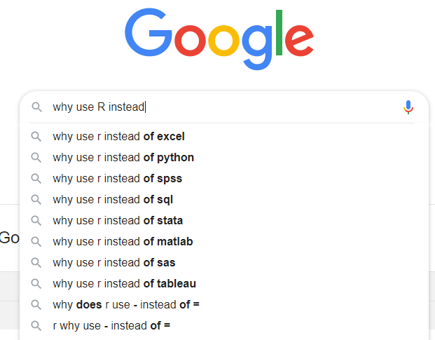
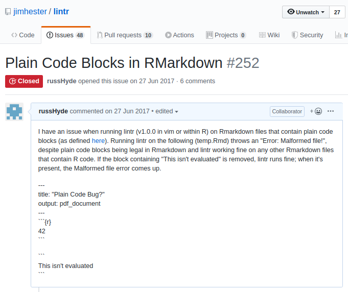
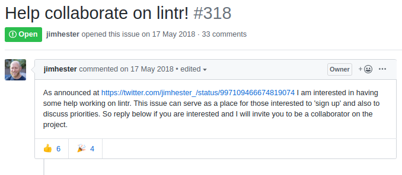
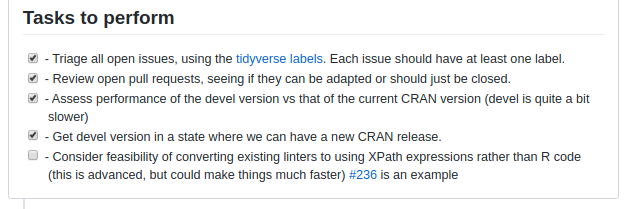

```{r setup, include=FALSE}
knitr::opts_chunk$set(echo = FALSE)
library(tibble)
```

## Why use R instead of {...}?



## We all get stuck

```{r}
simpleNet <- purrr::partial(networkD3::simpleNetwork,
                            height = "600px", width = "600px", linkDistance = 100,
                            opacity = 0.9, fontSize = 24,
                            fontFamily = "sans-serif", charge = -50)
```

```{r, echo = FALSE}
getting_stuck_data <- data.frame(
  from = "help(help)",
  to = c(
    "twitter.com/#rstats", "r4ds.online", "stack-overflow",
    "biostars / bioconductor", "github"
  )
)
```

```{r, echo = FALSE}
getting_stuck_plot <- simpleNet(
  getting_stuck_data, nodeColour = "#499382"
)
```

```{r}
getting_stuck_plot
```

## We all want to improve & we can all help each other

```{r, echo = FALSE}
learning_stuff_data <- tribble(
  ~from, ~to,
  "Learning", "Project-Oriented",
  "Learning", "Code-Challenges",
  "Learning", "Code-Reviews",
  "Project-Oriented", "#TidyTuesday",
  "Project-Oriented", "Kaggle.com",
  "Code-Challenges", "Exercism.io",
  "Code-Challenges", "CodeWars.com",
  "Code-Reviews", "codereview.stackexchange"
)
```

```{r, echo = FALSE}
learning_stuff_plot <- simpleNet(learning_stuff_data, nodeColour = "#935849")
```

```{r}
learning_stuff_plot
```

## Hurdles to Open Source Contribution {.centered}

{width=500px}

## Let's do something for the community ...

Jumping Rivers `meetingsR` list:

Website: [https://jumpingrivers.github.io/meetingsR/](https://jumpingrivers.github.io/meetingsR/)

GitHub: [https://github.com/jumpingrivers/meetingsR/](https://github.com/jumpingrivers/meetingsR)

README: [.../blob/master/README.md](https://github.com/jumpingrivers/meetingsR/blob/master/README.md)

## `git` terminology

<span style="color:purple">FORK</span>
- Make me a copy of this repo(sitory) on github

<span style="color:purple">PULL</span>
- Download this repo to my computer

(Make the changes you need)

<span style="color:purple">ADD / COMMIT</span>
- Add these changes to my local copy of this repo

<span style="color:purple">PUSH</span>
- Upload my updated version of this repo to github

<span style="color:purple">PULL REQUEST</span>
- Tell the author of this repo that they can include my changes

## Live section:

- Add "Glasgow R" to the `meetingsR` list using github

- [European User's Groups](https://github.com/jumpingrivers/meetingsR/edit/master/02_useR_groups_europe.Rmd)

## On Open Source Contributions

<span style="color:purple">_Not all contributions are code contributions [... or docs ...]_</span>

<span style="color:purple">...</span>

<span style="color:purple">_Just helping people filter, and curate, and figure-out what is in a ticket and if it's really important... I can't tell you how useful this is_</span>

Heather C Miller: Interviewed on [CoRecursive](https://corecursive.com/038-heather-miller-open-source/)
podcast (2019-09-15)

## `lintr` and your code

```{r, echo = TRUE}
library(lintr) # lintr 2.0.0; author: Jim Hester
```

```{r}
f <- file.path("temp", "lint_me.R")
cat(
'# Temp file
abc = 123
my.df <- data.frame(x = 1:3, y = rnorm(3))
is_it_a_matrix <- sapply(1:3, function(x) rbinom(x, 10, 0.5))
message("superfluous_semicolon");
',
  file = f
)
```

```{r, code = readLines(f), eval = FALSE, echo = TRUE}
```

```{r, echo = TRUE}
lint(filename = f)
```

## My first `lintr` issue (2017-06-27)



## My first `lintr` PR (2018-09-17)

[GitHub](https://github.com/jimhester/lintr/pull/349)

- Accepted 2018-09-18

- Got into CRAN `lintr` Sept 2019

- What happened in between?

(Note : I was really fixing a problem with my package [dupree](https://github.com/russHyde/dupree/))

## How to find collaborators?





## A Common Theme:

- One (few) main developer

- Lots of open issues

    - questions, duplicates, bugs, feature requests

    - unlabelled or solved issues

- To help: <span style="color:purple">Curate and Filter</span>

    - label the issues

    - close fixed issues

    - ask for / find a reproducible example

[But uncommon: Few packages, but many package developers, depend on `lintr`)]

## How to find a project to help?

[https://www.codetriage.com/](https://www.codetriage.com/?language=R)

[https://hacktoberfest.digitalocean.com/](https://hacktoberfest.digitalocean.com/)

GitHub labels

- "help wanted", "good first issue", "tidy-dev-day"
- "reprex"
- ["hacktoberfest"](https://github.com/search?q=label%3Ahacktoberfest+state%3Aopen+is%3Aissue+language%3AR&type=Issues)

Ask

## `explainerr` - a sandbox project for learning git and regexes

```{r, message = FALSE}
if (! "explainerr" %in% installed.packages()) {
  devtools::install_github("russHyde/explainerr")
}
```

[https://github.com/russHyde/explainerr/](https://github.com/russHyde/explainerr/)

```{r, echo = TRUE}
explainerr::explain("object of type 'closure' is not subsettable")
```

## Cheers

Slides: [http://rpubs.com/russH/535683]()

More about Open-Source Contribution

[Creating a pull request using `git`](https://opensource.com/article/19/7/create-pull-request-github)

[Creating a pull request using R and `usethis`](https://usethis.r-lib.org/articles/articles/pr-functions.html)

[Happy Git With R](https://happygitwithr.com/)

Can OS projects be healthily maintained?

[Open Source Health and Diversity (CoRecursive)](https://corecursive.com/038-heather-miller-open-source/)

[Contributing to Open Source (Talk Python To Me)](https://talkpython.fm/episodes/show/132/contributing-to-open-source)

[Guide to Open Source Maintenance](https://github.com/commercialhaskell/commercialhaskell/blob/master/guide/open-source-maintenance.md)

# Appendix

## Me & R

Experimental things on github (@russHyde)

- [dupree](https://github.com/russHyde/dupree)
    - duplicate code detection (built on `lintr`)

- [polyply](https://github.com/russHyde/polyply)
    - extend dplyr verbs to sets of data-frames

- bioinformatics stuff

Recent contributions to bigger projects

- [lintr](https://github.com/jimhester/lintr)

## Non-default linters

```{r, echo = TRUE}
lint(
  filename = f,
  linters = with_defaults(
    assignment_linter = NULL, # "abc = 123" is fine
    fns = undesirable_function_linter(), # catch `sapply`
    semis = semicolon_terminator_linter()
  )
)
```
